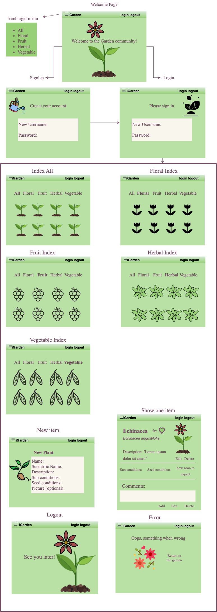

# Overview

## How to Grow Stuff - iGarden

Ever wondered how to grow stuff? Me too! This app will help us both accomplish that. This app will show various plants and the conditions they need to thrive. Plants include herbs, flowers, vegetables, and fruits! Users can explore plants listed on the app and favorite them along the way.

Data source is provided by https://www.growstuff.org/

*Please note that I didn't choose this option because of our Frootr app. I searched through many apis before I came full circle back to plants...

# User Stories

Users can...
* signup
* login/logout
* search for plants
* filter plants by category
* comment on plants
* favorite plants
* edit plants owned by them
* delete plants owned by them

# Wireframes / Entity Relationship Diagrams

# Back-up Idea: 

Dinosaurs or Animal Crossing: New Horizons

* https://dinosaur-facts-api.shultzlab.com/
* https://acnhapi.com/
